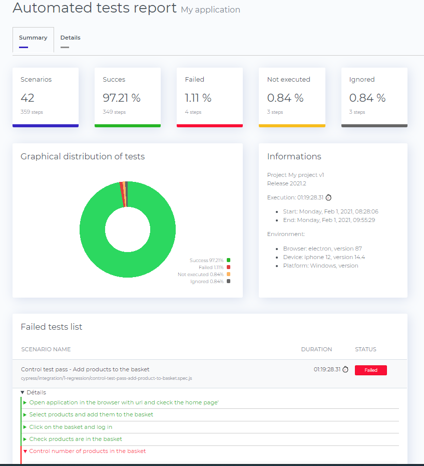

# mocha-reporter



Merge several [Mochawesome](https://github.com/adamgruber/mochawesome) JSON reports and generate html report like [Mochawesome-report-generator](https://github.com/adamgruber/mochawesome-report-generator) but little bit different. No js and no external links

## Features

- Summary tab with graph, informations and failed tests list 
- Details tab with all tests
- Test informations status and duration
- Test code for each step
- Test screenshot if failed


## Installation

via `npm`:

```
$ npm install mocha-reporter --save-dev
```

## Writing tests

In order to obtain the correct number of scenarios, it is best to write the tests like this: 

```
describe('My scenario. Use describe or context', () => {
  it('My first test, or step', () => {
  })
  it('My second test', () => {
  })
})
```
You can write 1 scenario per file, or several scenarios per file.

## Examples

### JavaScript API

```javascript
const { merge } = require('mocha-reporter')

// See Params section below
const options = {
  files: [
    './report/*.json',

    // you can specify more files or globs if necessary:
    './mochawesome-report/*.json',
  ],
  metadata:{
    browser: {
      name: 'electron',
      version: '87'
    },
    device: {
      name: 'iphone 12',
      version: '14.4'
    },
    platform: {
      name: 'Windows',
      version: '10'
    }
  },
  customData: {
    title: 'My application',
    data: [
      {label: 'Project', value: 'My project v1'},
      {label: 'Release', value: '2021.2'},
    ]
  }
}

merge(options)
```

### CLI

```
$ npx mocha-reporter -f ./report/*.json -r report/mocha-reporter
```

You can specify as many paths as you wish:

```
$ npx mocha-reporter -f ./report/*.json ./mochawesome-report/*.json r report/mocha-reporter
```

### Params

- `files`: list of source report file paths. Can include glob patterns.
- Aliases: `-f | --files` or first positional argument
- Defaults to `["./mochawesome-report/mochawesome*.json"]`.
#
- `reportDir`: a file path to the bundled results. Should be a `json` file 
- Aliases: `-r | --reportDir`
- Defaults to `stdout`.

## [Cypress](https://github.com/cypress-io/cypress)

The motivation to create this custom report is tu use [mochawesome](https://github.com/adamgruber/mochawesome) together with [Cypress](https://github.com/cypress-io/cypress) and to bypass some technical constraints.

Since the version `3.0.0`, Cypress runs every spec separately, which leads to generating multiple mochawesome reports, one for each spec. `mocha-reporter` can be used to merge these reports and then generate one HTML report for all your cypress tests.

First, configure `cypress.json`:

```jsonc
{
  // use mochawesome reporter as usually
  "reporter": "mocha-reporter",
  "reporterOptions": {
    // path to generate report.json and report.html
    "reportDir": "mocha/mochareports/",
  },
  "metadata":{
    "browser": {
      "name": "electron",
      "version": "87"
    },
    "device": {
      "name": "iphone 12",
      "version": "14.4"
    },
    "platform": {
      "name": "Windows",
      "version": "10"
    }
  },
  "customData": {
    "title": "My application",
    "data": [
      {"label": "Project", "value": "My project v1"},
      {"label": "Release", "value": "2021.2"}
    ]
  }
}
```

Then, write your custom script to run `cypress` together with `mocha-reporter`:

```javascript
const cypress = require('cypress')
const { merge } = require('mocha-reporter')

/* 
You can add cypress.json file to constant :
const { reporterOptions } = require('./cypress.json')

or add reporterOptions constant :
const reporterOptions = {
  "reportDir": "mocha/mochareports/",
  "metadata":{},
  "customData": {}
}
*/

cypress.run().then(
  () => {
    generateReport(reporterOptions)
  },
  error => {
    generateReport()
    console.error(error)
    process.exit(1)
  }
)

function generateReport(reporterOptions) {
  return merge(reporterOptions)
}
```
